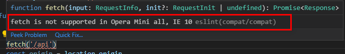
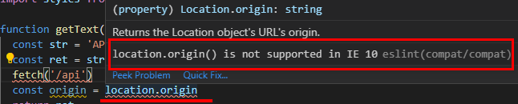

# eslint-plugin-compat

## 简介

eslint 插件，用来检查 js API 在目标浏览器上的兼容性。  
基于 [browserslist](https://github.com/browserslist/browserslist) 来指定目标浏览器，检查所使用的 js API 是否在所有指定的目标浏览器上可用。

## 配置 eslint-plugin-compat

1. 安装

   ```sh
   yarn add -D eslint-plugin-compat
   ```

2. 更新 eslint 配置文件

   **.eslintrc.js**

   ```js
   {
     "extends": ["plugin:compat/recommended"],
     "env": {
       "browser": true
     },
     // ...
   }
   ```

3. 指定目标浏览器

   **package.json**

   ```json
   {
     "browserslist": ["defaults", "> 0.2%", "ie > 9"]
   }
   ```

   如果未指定，默认使用 `browserslist` 的默认值 `defaults` (`"> 0.5%, last 2 versions, Firefox ESR, not dead"`)

## 效果展示

配置完 `eslint-plugin-compat` 之后，如果代码中使用了构建目标浏览器不支持的 js API, 该插件将会给出错误提示：

尝试使用 `fetch()` 方法，会出现以下报错提示：



尝试使用 `location.origin` 属性，会出现以下报错提示：



## 处理报错信息

1. 添加所需的 js API 的 polyfill；
2. 添加 polyfill 信息到 eslint 配置文件 `.eslintrc.js` 中 `settings.polyfills` 数组中：

   例如去除上面两个错误提示：

   **.eslintrc.js**

   ```js
   {
     // ...
     "settings": {
       "polyfills": [
         // 添加 fetch 的 polyfill
         "fetch",
         // 添加 location.origin 属性的 polyfill
         "location.origin"
       ]
     }
   }
   ```

## 不足

`eslint-plugin-compat` 插件对于不确定的实例对象，无法判断该实例方法的兼容性，所以为了避免误报，`eslint-plugin-compat` 选择跳过对这类 API 的检查。
