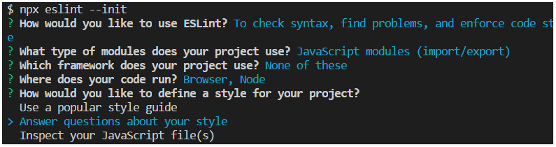

# eslint

[eslint](https://cn.eslint.org/) 是一个插件化的JavaScript代码检查工具，可以让程序员在编码的过程中发现问题而不是在执行的过程中。  

## 快速开始
### 安装eslint
```sh
yarn add -D eslint
```

### 创建eslint配置文件
```sh
./node_modules/.bin/eslint --init
```
> 替代命令： `npx eslint --init` 。

接下来eslint会询问一些问题，通过这些问题来生成配置文件，其中选择代码风格时，选择询问问题比较方便一点：  
  
选择完毕，根目录自动生成 `.eslintrc.js` 。

### 运行eslint
```sh
npx eslint demo.js
```

## 进阶使用
### 配置规则
在eslint配置文件中，可以看到许多类似这样的规则：  
```js
{
  "rules": {
    "semi": ["error", "never"],
    "quotes": ["error", "single"],
    "eqeqeq": "error"
  }
}
```  

`"semi"` 和 `"quotes"` 是eslint中 [规则](https://cn.eslint.org/docs/rules/) 的名称；  
数组中第一个值为错误级别，可以为：  
-  `"off"` 或 `0` - 关闭该规则
-  `"warn"` 或 `1` - 警告级别的规则（不会影响退出码）
-  `"error"` 或 `2` - 错误级别的规则（退出码为1）
第二个值为规则的额外选项。  

eslint自动生成的配置文件中包含下面一行：  
```js
"extends": "eslint:recommended"
```  
由于这行，所有在 [规则页面](https://cn.eslint.org/docs/rules/) 打勾的规则会默认开启。  


### 配置eslint的方式
- 配置文件的方式
- JavaScript注释的方式  
  例如文件中使用了全局变量 `global_x` ，eslint会提示 `no-undef` 错误，此时可以使用JavaScript注释的方式指定全局变量：  
  ```js
  function add (x){
    /* global global_x */
    return global_x + x
  }
  ```

### 使用块注释来临时禁用规则
可以使用如下格式的块注释来临时禁用eslint：  
```js
/* eslint-disable */

console.log('foo')

/* eslint-enable */
```  
#### 对指定的规则进行临时禁用 
```js
/* eslint-disable no-console, no-alert */

alert('hello')
console.log('eslint')

/* eslint-enable no-console, no-alert */
```  
> 如果需要对整个文件禁用eslint(或某个具体规则)，直接将 `/* eslint-disable */` 放在文件开头即可。也就是说如果禁用eslint之后没有再次启用的注释（如： `/* eslint-enable */` ），则之后的部分都一直禁用。  

#### 对某一行进行临时禁用
```js
// =====  对下一行禁用 =====

/* eslint-disable-next-line */
console.log('foo')

/* eslint-disable-next-line no-alert, quotes, semi */
alert("foo");

// =====  对当前行禁用 =====

console.log('foo')  /* eslint-disable-line */

alert("foo");  /* eslint-disable-line no-alert, semi, quotes */
```

### eslint忽略文件
可以通过创建一个 `.eslintignore` 的文件来配置eslint需要忽略的文件和目录。  
`.eslintignore` 的忽略模式同 `.gitignore` 。  
另外， eslint默认忽略 `/node_modules/*` 和 `/bower_components/*` 。【注意**忽略的是根目录下的**】
```sh
# /node_modules/*  and /bower_compontents/* are ignored by default

# ignore build/ except build/index.js
build/
!build/index.js

# 注意 /build 和 build/ 的区别
```