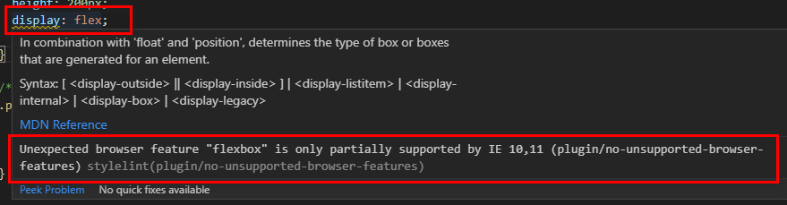

# stylelint 插件

- [stylelint-no-unsupported-browser-features](#stylelint-no-unsupported-browser-features)
  - [使用](#%e4%bd%bf%e7%94%a8)
    - [1.安装](#1%e5%ae%89%e8%a3%85)
    - [2.更新 stylelint 配置文件](#2%e6%9b%b4%e6%96%b0-stylelint-%e9%85%8d%e7%bd%ae%e6%96%87%e4%bb%b6)
    - [3.检查不支持的样式](#3%e6%a3%80%e6%9f%a5%e4%b8%8d%e6%94%af%e6%8c%81%e7%9a%84%e6%a0%b7%e5%bc%8f)
  - [去除警告信息](#%e5%8e%bb%e9%99%a4%e8%ad%a6%e5%91%8a%e4%bf%a1%e6%81%af)

## stylelint-no-unsupported-browser-features

`stylelint-no-unsupported-browser-features` 插件可以根据 `browserslist` 的指定浏览器列表，对某些浏览器不支持样式进行提示。

### 使用

#### 1.安装

```sh
yarn add -D stylelint-no-unsupported-browser-features
```

#### 2.更新 stylelint 配置文件

**.stylelintrc.js**

```js
// stylelint-no-unsupported-browser-features 忽略的检查
const snubfPluginIgnores = []

module.exports = {
  //...
  plugins: ['stylelint-no-unsupported-browser-features'],
  rules: {
    'plugin/no-unsupported-browser-features': [
      true,
      {
        // 报错等级, 推荐使用警告等级 warning
        severity: 'warning',
        // 需要忽略的检查
        ignore: snubfPluginIgnores,
      },
    ],
  },
}
```

#### 3.检查不支持的样式

例如： 浏览器构建目标中包含 `IE 11`，且在样式文件中使用了 `display: flex;` 之后，会有如下提示：



### 去除警告信息

要去除警告，可以将指定的规则添加到 `snubfPluginIgnores` 数组中。  
例如上面的 `display: flex;` ，需要将 `"flexbox"` 规则忽略：

**.stylelintrc.js**

```js
const snubfPluginIgnores = ['flexbox']

module.exports = {
  // ...
}
```
