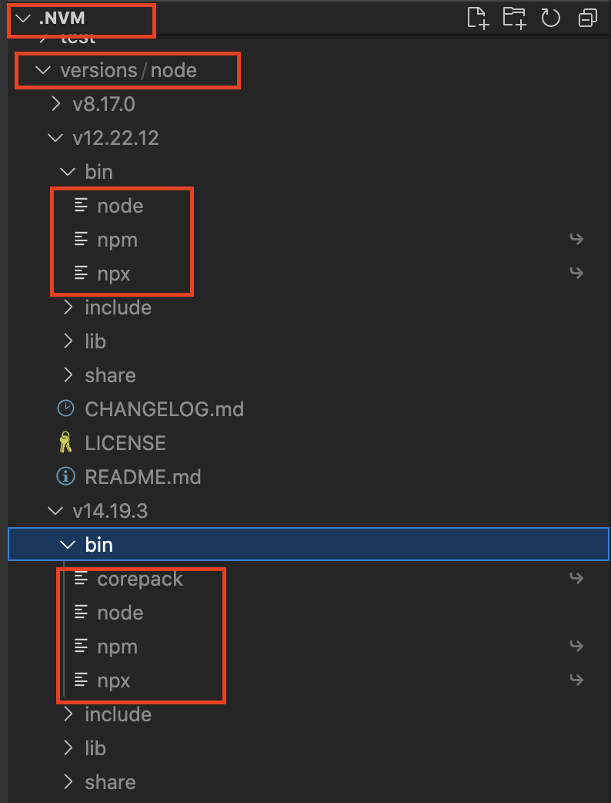
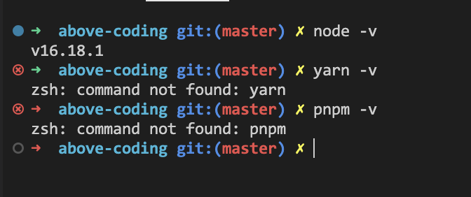
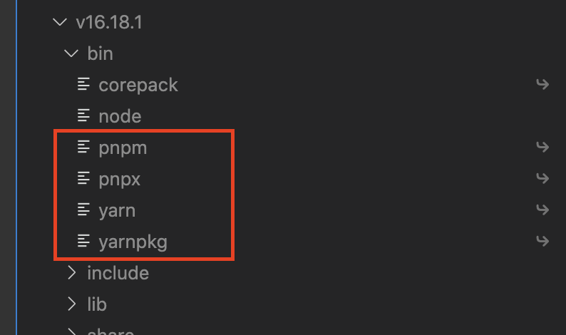
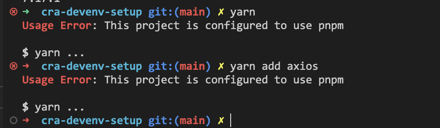

# corepack 管理包管理器

- [简介](#简介)
- [使用](#使用)
  - [启用 corepack](#启用-corepack)
  - [corepack 优势](#corepack-优势)
    - [1.自带 yarn 和 pnpm，节省安装时间](#1自带-yarn-和-pnpm节省安装时间)
    - [2.避免包管理器混用](#2避免包管理器混用)
- [其他 corepack 命令](#其他-corepack-命令)
  - [1.启停用 corepack](#1启停用-corepack)
  - [2.使用指定版本的包管理器](#2使用指定版本的包管理器)
  - [3.生产环境离线使用](#3生产环境离线使用)
- [参考](#参考)

<style>
  img {
    max-width: 300px;
  }
</style>

## 简介

corepack 提供除了 npm 之外的 yarn 和 pnpm 包管理器，并且可以限制项目中只允许使用特定的包管理器，避免包管理器混用。

## 使用

> corepack 默认与 nodejs 一起分发， nodejs 版本需要大于等于 `14.19.0` 或 `16.9.0`。

如下图所示，在 `.nvm/versions/node` 目录中， `12.22.12` 版本的 `bin` 目录中没有 `corepack` 命令，而 `14.19.3` 版本的 `bin` 目录中有 `corepack` 命令。



### 启用 corepack

由于当前 `corepack` 处于实验阶段，所以需要手动启用。

先检查是否已经安装 `yarn` 和 `pnpm`：



输入以下命令启用 `corepack`：

```sh
corepack enable
```

启用后自动生成 `yarn` 和 `pnpm` 的快捷命令：



此时就可以使用 `yarn` 和 `pnpm` 命令了，默认安装的版本是在该版本 nodejs 发版时最新的 `yarn` 和 `pnpm` 版本。

### corepack 优势

#### 1.自带 yarn 和 pnpm，节省安装时间

使用 `corepack enable` 后，无需下载即可使用 `yarn` 和 `pnpm`。

#### 2.避免包管理器混用

为了避免在项目中混用 `npm` 、`yarn`、`pnpm` 包管理器，可以使用 `corepack` 配合 `package.json > packageManager` 属性来指定包管理器。

例如： 在 `package.json` 中指定 `pnpm@7.3.0` ：

```json
{
  "name": "node-pnpm-project",
  "version": "0.0.0",
  "packageManager": "pnpm@7.3.0",
  "scripts": {
    "test": "echo \"Error: no test specified\" && exit 1"
  }
}
```

使用 `yarn` 命令会抛出错误：



但是默认情况下不会阻止 `npm` 命令，为了能让 npm 作为全局包管理器在任何项目完美运行。  
如果也想要拦截 `npm` ，需要使用以下命令：

```sh
corepack enable npm
```

> 包管理器版本与 `packageManager` 中指定的版本不匹配时，会静默下载匹配的版本并使用该版本。

## 其他 corepack 命令

### 1.启停用 corepack

启用 corepack：

```sh
# 启用
corepack enable
# 启用对于 npm 的管理
corepack enable npm

```

停用 corepack：

```sh
# 停用
corepack disable
# 停用对于 npm 的管理
corepack disable npm
```

### 2.使用指定版本的包管理器

例如想要使用 `pnpm@7.4.0` 版本替代 `packageManager` 指定的 `7.3.0` 版本，可以这样写：

```sh
corepack prepare pnpm@7.4.0 --activate
```

其中 `prepare` 代表下载该版本的包管理器， `--activate` 代表使用该版本的包管理器并设置为默认。

### 3.生产环境离线使用

生产环境如果没有外网访问权限，可以先在外网机器上打包指定版本的包管理器到指定路径。命令如下：

```sh
corepack prepare [...name@version] --output=<path/to/corepack.tgz>
```

例如，下载 `pnpm@7.4.0` 版本到 `/tmp/corepack-pnpm.7.4.0.tar.gz`：

```sh
corepack prepare pnpm@7.4.0 --output=/tmp/corepack-pnpm.7.4.0.tar.gz
```

运行命令后将会在 `/tmp` 目录下生成 `corepack-pnpm.7.4.0.tar.gz` 文件，将该文件复制到离线环境中供使用。

> 该命令支持同时打包多个包管理器或版本，例如： `corepack prepare pnpm@7.4.0 pnpm@7.3.0 yarn@1.22.0 --output=<path/to/corepack.tgz>`，或者直接指定 `--all` 参数将当前使用的 `npm/yarn/pnpm` 版本打包。

离线环境使用以下命令来安装：

```sh
corepack hydrate <path/to/corepack.tgz>
```

例如，安装 `/tmp/corepack-pnpm.7.4.0.tar.gz`：

```sh
corepack hydrate /tmp/corepack-pnpm.7.4.0.tar.gz
```

如果想要安装后设置默认使用该版本，可以加上 `--activate` 参数。

## 参考

1. [Node.js Corepack](https://juejin.cn/post/7111998050184200199)
