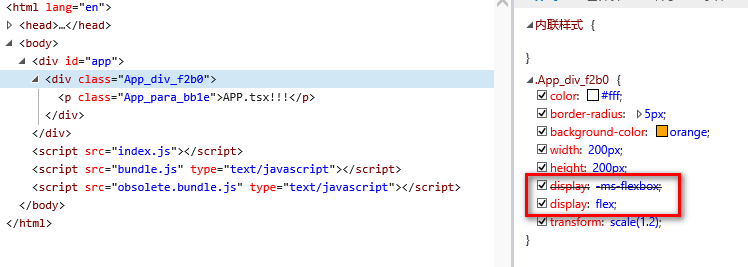

# autoprefixer

- [介绍](#%e4%bb%8b%e7%bb%8d)
- [使用](#%e4%bd%bf%e7%94%a8)
  - [1.安装](#1%e5%ae%89%e8%a3%85)
  - [2.修改 webpack 配置文件](#2%e4%bf%ae%e6%94%b9-webpack-%e9%85%8d%e7%bd%ae%e6%96%87%e4%bb%b6)
  - [3.检查插件效果](#3%e6%a3%80%e6%9f%a5%e6%8f%92%e4%bb%b6%e6%95%88%e6%9e%9c)
- [补充](#%e8%a1%a5%e5%85%85)

## 介绍

`autoprefixer` 是一个 `postcss` 插件，用于根据指定的 `browserslist` 而自动为浏览器添加前缀。

> `postcss` 是一个用 js 来处理样式代码的工具，提供很多插件来对样式做各种处理。

## 使用

> 只介绍和 webpack 一起使用的配置方式。

### 1.安装

```sh
yarn add -D postcss-loader autoprefixer
```

### 2.修改 webpack 配置文件

**webpack.config.js**

```js
// 引入 autoprefixer
const autoPrefixer = require('autoprefixer')

module.exports = {
  // ...
  module: {
    rules: [
      {
        test: /\.(css|scss|sass)$/,
        use: [
          'style-loader',
          {
            loader: 'css-loader',
            options: {
              importLoaders: 2, // 可以省略
            },
          },
          // 注意： postcss-loader 放在 css-loader 之后，sass-loader 之前
          {
            loader: 'postcss-loader',
            options: {
              plugins: [autoPrefixer], // 配置 postcss 插件
            },
          },
          'sass-loader',
        ],
      },
    ],
  },
}
```

### 3.检查插件效果

`browserslist` 中包含 `IE 11` 的情况下，书写 `IE 11` 需要加前缀的属性，例如 `display: flex;`， 然后打开 `IE 11` 查看效果：



可以看到，自动添加上了 `-ms-` 前缀的属性。

## 补充

除了在 `webpack.config.js` 中配置 `postcss` 插件之外，如果使用的插件较多的情况下，可以考虑使用单独的配置文件。

以 `autoprefixer` 为例， 创建 `postcss.config.js` 文件：

```js
const autoPrefixer = require('autoprefixer')

module.exports = {
  plugins: [autoPrefixer],
}
```
