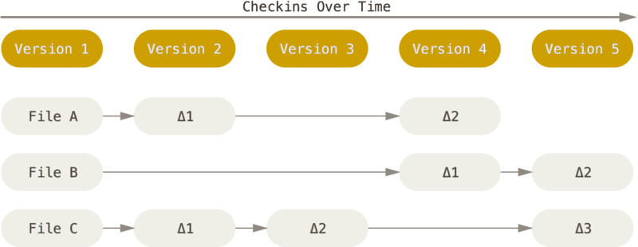
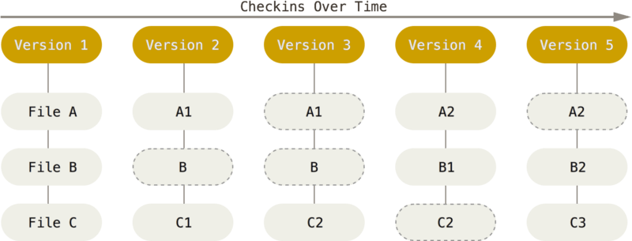
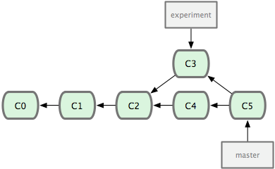

# git 笔记

> 这篇文档是《Pro Git》的阅读笔记。

- [1.3 起步 - Git 基础](#13-起步---git基础)
  - [Git 存储数据的方法](#git存储数据的方法)
- [1.6 起步 - 初次运行 Git 前的配置](#16-起步---初次运行git前的配置)
  - [读写 Git 的配置信息](#读写git的配置信息)
    - [查看配置信息](#查看配置信息)
- [1.7 起步 - 获取帮助](#17-起步---获取帮助)
  - [获取 Git 命令的用法](#获取git命令的用法)
- [2.2 Git 基础 - 记录每次更新到仓库](#22-git基础---记录每次更新到仓库)
  - [Git 状态简览](#git状态简览)
  - [gitignore 文件](#gitignore文件)
  - [查看改动](#查看改动)
  - [跳过添加到暂存区](#跳过添加到暂存区)
  - [移除文件](#移除文件)
    - [特例](#特例)
- [2.4 撤销操作](#24-撤销操作)
  - [修改最后一次提交](#修改最后一次提交)
- [2.5 远程仓库的使用](#25-远程仓库的使用)
  - [查看远程仓库](#查看远程仓库)
  - [添加远程仓库](#添加远程仓库)
  - [从远程仓库抓取数据](#从远程仓库抓取数据)
  - [远程仓库的删除和重命名](#远程仓库的删除和重命名)
- [2.6 打标签](#26-打标签)
  - [新建标签](#新建标签)
  - [查看标签](#查看标签)
  - [推送标签](#推送标签)
  - [删除标签](#删除标签)
- [3.2 分支的新建与合并](#32-分支的新建与合并)
  - [新建分支](#新建分支)
  - [推送本地分支到远程仓库](#推送本地分支到远程仓库)
  - [从远程仓库删除分支](#从远程仓库删除分支)
- [3.6 分支的衍合](#36-分支的衍合)
  - [衍合的风险](#衍合的风险)
  - [衍合时的冲突解决](#衍合时的冲突解决)

## 1.3 起步 - Git 基础

### Git 存储数据的方法

大部分版本控制工具以文件的变更列表的方式存储信息。将保存的信息看作是一组基本文件和每个文件随时间逐步累积的差异。  
  
而 Git 保存项目时，是对当时的全部文件制作一个**快照**并保存这个快照的索引。如果文件没有更改，不再重新存储，而是保留一个链接指向之前存储的文件。  


## 1.6 起步 - 初次运行 Git 前的配置

### 读写 Git 的配置信息

Git 配置文件存放位置有 3 处：

| 级别     | 位置           | 读写所需参数 | 备注                    |
| -------- | -------------- | ------------ | ----------------------- |
| 系统级别 | /etc/gitconfig | --system     | WINDOWS 在 Git 安装目录 |
| 用户级别 | ~/.gitconfig   | --global     |                         |
| 项目级别 | /.git          |              | &nbsp;                  |

> Git 配置信息相同的键按照就近原则进行覆盖。

安装完 Git 之后的第一件事，应该是设置用户名和邮箱，因为每次 Git 提交都需要将这些信息写入提交中：

```sh
git config --global user.name "xxx"
git config --global user.email "xxx@xx.com"
```

这里全局设置了用户名和邮箱，如果想针对特定项目使用其它用户名和邮箱，只需要在那个项目目录设置并且不加 `--global` 参数。

#### 查看配置信息

```sh
# 查看全部配置信息
git config --list

# 查看某个级别的配置信息，如全局的
git config --global --list

# 查看某一项信息, 如 全局的user.name
git config --global user.name
```

## 1.7 起步 - 获取帮助

### 获取 Git 命令的用法

获取 Git 命令的使用方法，可以使用 `--help` 参数，这会打开本地的 Git 使用帮助手册：

```sh
git <verb> --help
```

## 2.2 Git 基础 - 记录每次更新到仓库

### Git 状态简览

`git status -s` 或者 `git status --short` 可以得到更紧凑的格式输出：

```sh
git status -s

 M README
MM Rakefile
A  lib/git.rb
M  lib/simplegit.rb
?? LICENSE.txt

```

每个文件前面有两个标志位，第一个代表暂存区的状态，第二个代表当前工作目录的状态。

| 符号 | 含义           |
| ---- | -------------- |
| `??` | 文件尚未被跟踪 |
| `M`  | 修改过的文件   |
| `A`  | 新添加的文件   |

### gitignore 文件

> 要养成仓库初始化完就设置 `.gitignore` 文件的习惯。

`.gitignore` 文件的格式规范：

| 格式               | 含义                         |
| ------------------ | ---------------------------- |
| #                  | 注释                         |
| 以`/`开头          | 根目录下的                   |
| 以`/`结尾          | 文件夹                       |
| !                  | 取反                         |
| 支持标准 glob 模式 | shell 所用的简化的正则表达式 |

示例：

```sh
# 忽略所有 .a 文件
*.a

# 但是不忽略 xxx.a
!xxx.a

# 忽略 node_modules 文件夹
node_modules/

# 仅忽略 根目录下的 node_modules 文件夹
/node_modules/

# 两个 * 号， 匹配任意个中间目录， 如 a/**/z, 匹配 a/z, a/b/z, a/b/c/z ...
# 如：忽略 doc 文件夹下所有 .log 文件
doc/**/*.log

```

### 查看改动

查看未暂存的修改： `git diff`  
查看已暂存的修改： `git diff --cached`

### 跳过添加到暂存区

对于**已经跟踪过的文件**，可以跳过 `git add` 添加到暂存区这一步直接提交，只需要在 `git commit` 时加上 `-a` 参数：

```sh
git commit -am 'commit comments'
```

### 移除文件

最直接的方法就是先从工作目录删除，然后 `git rm` 记录此次删除操作。  
也可以直接使用 `git rm` 命令删除文件。

#### 特例

如果想要 Git 不再跟踪某个文件，但是又不想将该文件从工作目录删除，（例如：忘记将日志文件添加到 `.gitignore` 中而导致错误地提交给 Git 进行版本控制了），此时可以使用 `git rm --cached xxx.log` 将该文件从暂存区删除，再次提交之后该文件将不再被纳入版本控制，当然别忘了将其添加到 `.gitignore` 中。

## 2.4 撤销操作

### 修改最后一次提交

```sh
git commit --amend
```

该命令可以重新编辑上一次提交的提交信息。  
如果上一次提交忘记了某些操作，也可以先补上这些操作，然后再 `git commit --amend` ：

```sh
git commit -m 'commit msg'
# 补上忘记添加的修改
git add forgotten_file
git commit --amend
```

## 2.5 远程仓库的使用

### 查看远程仓库

```sh
# 只显示远程仓库的shortname
git remote

# 显示远程仓库的shortname 和 url
git remote -v
```

### 添加远程仓库

```sh
git remote add [shortname] [url]
```

### 从远程仓库抓取数据

```sh
git fetch [shortname]
```

`git fetch` 会抓取远程仓库的所有更新信息到本地，但是不会自动合并到当前分支，需要手动合并。

> `git fetch` 和 `git pull` 的区别：  
> `git pull` 拉取数据之后自动合并到当前分支，而 `git fetch` 只是拉取到本地，合并需要自己 `git merge` 。

### 远程仓库的删除和重命名

```sh
# 重命名远程仓库
git remote rename [oldname] [newname]

# 删除远程仓库
git remote remove [shortname]
```

## 2.6 打标签

### 新建标签

为上一次提交打标签：

```sh
git tag -a [tagname] -m 'my version v0.4'
```

为指定的某次提交打标签：

```sh
git tag -a [tagname] [commit-id] -m 'my version v0.2'
```

### 查看标签

```sh
# 列出所有标签
git tag

# 查看某个标签具体信息
git show [tagname]
```

### 推送标签

标签不会被普通的 `git push` 操作推送到远端仓库，需要显式地提交标签：

```sh
git push origin [tagname]

# 一次性推送所有标签
git push origin --tags
```

### 删除标签

```sh
git tag -d [tagname]
```

## 3.2 分支的新建与合并

### 新建分支

```sh
git branch [branchname]

# 新建分支并切换
git checkout -b [branchname]
```

### 推送本地分支到远程仓库

```sh
git push [remote] [local_branch]:[remote_branch]
```

类似 `git push origin master` 这样的命令，其实是 `git push origin master:master` 的简写。

### 从远程仓库删除分支

```sh
git push [remote] :[remote_branch]
```

可以理解为将本地空白分支推送到远程仓库的 `remote_branch` 分支，即删除远程仓库的 `remote_branch` 分支。

## 3.6 分支的衍合

最简单的整合分支的方法是 `merge` 命令，它会把两个分支最新的快照（C3，C4）以及二者最新的共同祖先（C2）进行**三方合并**，合并的结果是产生一个新的提交对象（C5），如下图：  
  
还有另外一个整合方法：把 C3 产生的变化作为补丁在 C4 的基础上重新打一遍，这种操作在 Git 中叫做 **衍合**(rebase)。  
原理：
回到两个分支的最近共同祖先，将当前分支（这里是 experiment）的后续历次提交（C3）生成一系列的文件补丁，然后以基底分支（这里是 master）最后一个提交（C4）为新的出发点，逐个应用这些补丁，生成一系列新的提交对象（C3'），从而改写当前分支（这里是 experiment）的提交历史，使它成为基底分支（这里是 master）的直接下游，如下图：  
  
现在可以回到基底分支（master）执行一次快进合并：  


`rebase` 操作相比于 `merge` ：

- 能够产生一个更为整洁的提交历史，好像所有修改都在一根时间线上进行的，尽管实际上使并行发生的；
- `rebase` 还有一个更实用的目的，**它可以把解决分支和最新主线代码之间冲突的责任，转化给提交分支的人**，在为某个项目帮点忙的时候，最适合使用 `rebase` 操作，先在自己的分支上进行工作，当准备向主项目提交补丁的时候，根据最新的 `origin/master` 进行一次 `rebase` 操作再提交，这样项目维护者就不需要做任何整合工作，只需根据你提供的仓库地址做一次快进合并，或是直接采纳你提交的补丁。

### 衍合的风险

衍合需要遵循的准则：**一旦分支中的提交推送到了公共仓库，就千万不要对该分支进行衍合操作。**

### 衍合时的冲突解决

在 `rebase` 过程中，也许会出现冲突，这时，Git 会停止 `rebase` 操作并让你去解决冲突，解决完冲突之后，**需要使用 `git add` 添加更新的内容到暂存区**，注意，无需 `git commit` ， Git 也会提示你只需要 `git rebase --continue` ，Git 即会继续应用余下的补丁文件。
