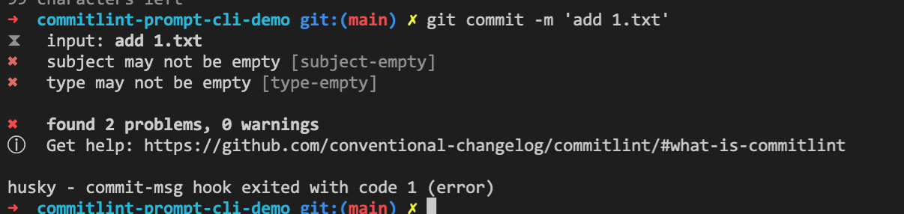
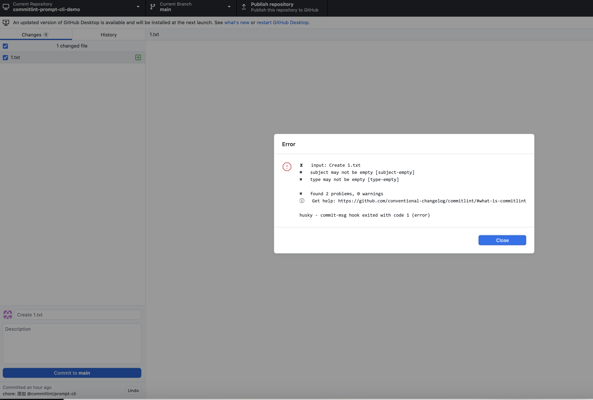
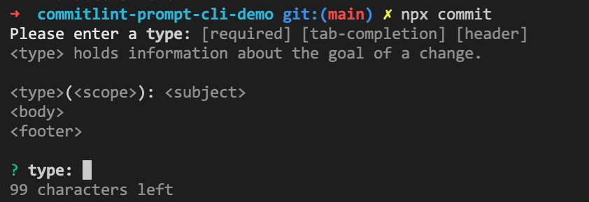
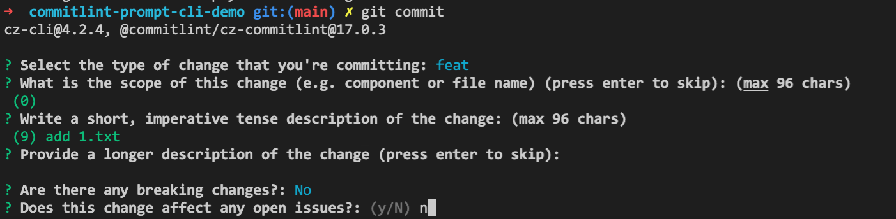
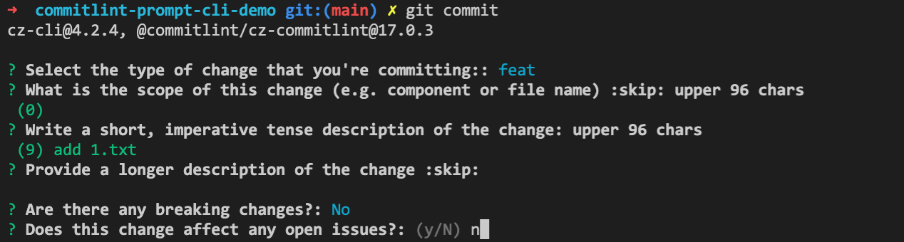

# git commit 提交信息规范化

这篇笔记主要介绍使用 `commitlint` 和 `commitizen` 来规范化 git 提交信息。

- [前置步骤](#前置步骤)
- [安装并配置 commintlint](#安装并配置-commintlint)
  - [安装 @commitlint/prompt-cli 【不推荐使用】](#安装-commitlintprompt-cli-不推荐使用)
- [commitizen 安装与配置](#commitizen-安装与配置)
  - [在 git commit 命令上应用 commitizen 【推荐使用】](#在-git-commit-命令上应用-commitizen-推荐使用)
- [commitlint 适配 commitizen](#commitlint-适配-commitizen)
  - [安装和配置 `@commitlint/cz-commitlint`](#安装和配置-commitlintcz-commitlint)
- [使用 gitmoji 【可选项】](#使用-gitmoji-可选项)
- [参考文档](#参考文档)

<style>
  img {
    max-width: 50%;
  }
</style>

## 前置步骤

初始化为 `git` 仓库和 `npm` 项目。

```sh
git init


npm init -y
```

## 安装并配置 commintlint

为什么要使用 `commitlint` ？

```
用于对 commit 信息作 lint 校验，强制提交信息必须符合指定的提交规范，否则无法提交。
```

安装

```sh
npm install --save-dev @commitlint/config-conventional @commitlint/cli
```

配置

```sh
# Configure commitlint to use conventional config
echo "module.exports = {extends: ['@commitlint/config-conventional']}" > commitlint.config.js
```

安装 husky（如已安装则跳过）

```sh
npm i husky -D

npx husky install
```

添加 husky 的 hook

```sh
cat <<EEE > .husky/commit-msg
#!/bin/sh
. "\$(dirname "\$0")/_/husky.sh"

npx --no -- commitlint --edit "\${1}"
EEE
```

将其设置为可执行：

```sh
chmod a+x .husky/commit-msg
```

配置成功后，如果提交信息不符合指定的规范（上面安装的 `@commitlint/config-conventional` 规范），将会提示以下错误阻止提交：



使用其他可视化提交工具（例如 `github desktop`）也能阻止提交并提示错误：



### 安装 @commitlint/prompt-cli 【不推荐使用】

安装

```
npm i -D @commitlint/prompt-cli
```

使用以下命令代替 `git commit` 来提交

```
npx commit
```

即可看到以下询问信息



## commitizen 安装与配置

为什么要使用 `commitizen` ？

```
提交时弹出询问信息，方便填写符合指定提交规范的提交信息。
```

为什么不使用 `commitlint` 自带的 `@commitlint/prompt-cli` ?

```
1. `commitizen` 的询问提示方式更好用
2. `commitizen` 可以配置为覆盖 `git commit` 命令的默认行为，直接使用 `git commit` 命令就可以弹出提示信息，多人合作时更可靠
```

> 以非全局安装（只应用于当前项目）的方式来安装和配置。

安装

```sh
npm i commitizen -D
```

配置

```sh
npx commitizen init cz-conventional-changelog --save-dev --save-exact

# 如果使用的是 yarn，使用下面的命令
# npx commitizen init cz-conventional-changelog --yarn --dev --exact
```

使用

```sh
npx cz

# 或者在 `package.json` 的 `scripts` 下添加命令 `"cm":"cz"`，然后 `npm run cm`
```

此时即可弹出提交信息选择询问信息。

> 为什么不在 `scripts` 中使用 `commit` 作为命令名而是使用 `cm`？
>
> - 因为当运行 `XXX` 命令时 npm 会自动执行 `preXXX` ，如果命名为 `commit` 且使用了 `husky` 且存在 `precommit` 命令，会导致运行 `precommit` 两次。

### 在 git commit 命令上应用 commitizen 【推荐使用】

> 为了避免提交时忘记使用 `npx cz` 来代替 `git commit` ，或者多人合作时其他成员不知道使用 `npx cz` 来提交，可以直接在 `git commit` 命令上应用 `commitizen` 来覆盖 `git commit` 的默认行为，这样每次使用 `git commit` 命令时就可以直接弹出 `commitizen` 询问提示了。

> 如果想要跳过 `commitizen` 询问提示时，直接 `ctrl + c` 即可。

安装 husky（如已安装则跳过）

```sh
npm i husky -D

npx husky install
```

配置 `prepare-commit-msg` hook

```sh
npx husky add .husky/prepare-commit-msg "exec < /dev/tty && npx cz --hook || true"
```

现在即可在输入 `git commit` 时出现 `commitizen` 询问提示了：


## commitlint 适配 commitizen

> 如果对于提交规范没有额外的自定义需求，是可以不用额外配置适配器的。

### 安装和配置 `@commitlint/cz-commitlint`

有些时候项目的提交规范需要自定义， 此时为了避免 `commitizen` 和 `commitlint` 都配置一份，需要使用适配器 `@commitlint/cz-commitlint`，配置之后 `commitizen` 将会使用 `commitlint.config.js` 中配置的自定义提交规范来展示询问提示信息。

安装

> 以下命令中如果已经安装了 commitizen 可以不用再次安装。

```sh
npm install --save-dev @commitlint/cz-commitlint commitizen inquirer@8  # inquirer is required as peer dependency
# or yarn
yarn add -D @commitlint/cz-commitlint commitizen inquirer@8             # inquirer is required as peer dependency
```

更新 `package.json` 中 `commitizen` 的配置

```json
{
  "config": {
    "commitizen": {
      "path": "@commitlint/cz-commitlint"
    }
  }
}
```

现在 `commitizen` 将遵循 `commitlint.config.js` 配置进行询问提示，验证 `commitizen` 是否遵循 `commitlint.config.js` 配置：

参考[这篇文档](https://commitlint.js.org/#/reference-prompt)自定义提交规范提示信息，更新 `commitlint.config.js` 配置信息：

```js
module.exports = {
  // ...

  // 自定义有哪些 type
  rules: {
    'type-enum': [
      2,
      'always',
      [
        'build',
        'chore',
        'ci',
        // 'docs',
        'feat',
        'fix',
        // 'perf',
        'refactor',
        'revert',
        'style',
        // 'test',
      ],
    ],
  },
  prompt: {
    settings: {},
    messages: {
      skip: ':skip',
      max: 'upper %d chars',
      min: '%d chars at least',
      emptyWarning: 'can not be empty',
      upperLimitWarning: 'over limit',
      lowerLimitWarning: 'below limit',
    },
    questions: {
      type: {
        description: "Select the type of change that you're committing:",
        // 对上面的自定义 rules 进行信息配置
        // 询问选择信息中 type 的展示顺序将按照这里出现的顺序
        enum: {
          feat: {
            description: 'A new feature',
            title: 'Features',
            emoji: '✨',
          },
          fix: {
            description: 'A bug fix',
            title: 'Bug Fixes',
            emoji: '🐛',
          },
          docs: {
            description: 'Documentation only changes',
            title: 'Documentation',
            emoji: '📚',
          },
          style: {
            description:
              'Changes that do not affect the meaning of the code (white-space, formatting, missing semi-colons, etc)',
            title: 'Styles',
            emoji: '💎',
          },
          refactor: {
            description:
              'A code change that neither fixes a bug nor adds a feature',
            title: 'Code Refactoring',
            emoji: '📦',
          },
          perf: {
            description: 'A code change that improves performance',
            title: 'Performance Improvements',
            emoji: '🚀',
          },
          test: {
            description: 'Adding missing tests or correcting existing tests',
            title: 'Tests',
            emoji: '🚨',
          },
          build: {
            description:
              'Changes that affect the build system or external dependencies (example scopes: gulp, broccoli, npm)',
            title: 'Builds',
            emoji: '🛠',
          },
          ci: {
            description:
              'Changes to our CI configuration files and scripts (example scopes: Travis, Circle, BrowserStack, SauceLabs)',
            title: 'Continuous Integrations',
            emoji: '⚙️',
          },
          chore: {
            description: "Other changes that don't modify src or test files",
            title: 'Chores',
            emoji: '♻️',
          },
          revert: {
            description: 'Reverts a previous commit',
            title: 'Reverts',
            emoji: '🗑',
          },
        },
      },
      scope: {
        description:
          'What is the scope of this change (e.g. component or file name)',
      },
      subject: {
        description:
          'Write a short, imperative tense description of the change',
      },
      body: {
        description: 'Provide a longer description of the change',
      },
      isBreaking: {
        description: 'Are there any breaking changes?',
      },
      breakingBody: {
        description:
          'A BREAKING CHANGE commit requires a body. Please enter a longer description of the commit itself',
      },
      breaking: {
        description: 'Describe the breaking changes',
      },
      isIssueAffected: {
        description: 'Does this change affect any open issues?',
      },
      issuesBody: {
        description:
          'If issues are closed, the commit requires a body. Please enter a longer description of the commit itself',
      },
      issues: {
        description: 'Add issue references (e.g. "fix #123", "re #123".)',
      },
    },
  },
}
```

以下是配置前和配置后提示信息对比，可以看到 `commitizen` 已经使用了 `commitlint.config.js` 的配置信息作提示：

- 配置 `@commitlint/cz-commitlint` 之前：

  

- 配置 `@commitlint/cz-commitlint` 之后：

  

## 使用 gitmoji 【可选项】

如果想要在 git 提交信息中包含 emoji，可以使用这个库 [commitlint-config-gitmoji](https://github.com/arvinxx/gitmoji-commit-workflow/tree/master/packages/commitlint-config)。

## 参考文档

- [commitizen/cz-cli 文档](https://github.com/commitizen/cz-cli)
- [commitlint 文档](https://github.com/conventional-changelog/commitlint)
- [husky 文档](https://github.com/typicode/husky)
  - 特别注意： [为什么 husky 放弃传统的 js 配置方式](https://blog.typicode.com/husky-git-hooks-javascript-config/)
- [@commitlint/cz-commitlint](https://github.com/conventional-changelog/commitlint/tree/master/%40commitlint/cz-commitlint)
