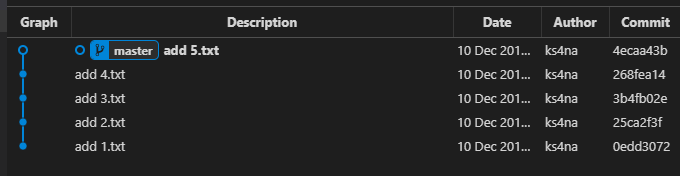
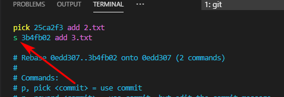
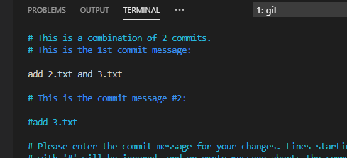
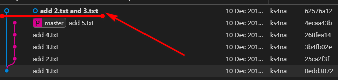
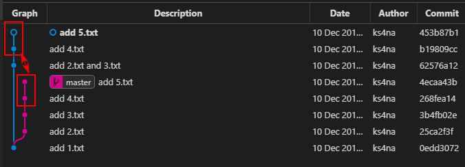
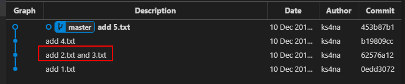

# git cherry-pick

- [使用场景](#%e4%bd%bf%e7%94%a8%e5%9c%ba%e6%99%af)
  - [1.将提交历史中间的部分 commit 合并（需要配合git rebase使用）](#1%e5%b0%86%e6%8f%90%e4%ba%a4%e5%8e%86%e5%8f%b2%e4%b8%ad%e9%97%b4%e7%9a%84%e9%83%a8%e5%88%86-commit-%e5%90%88%e5%b9%b6%e9%9c%80%e8%a6%81%e9%85%8d%e5%90%88git-rebase%e4%bd%bf%e7%94%a8)
  - [2.删除中间的部分 commit（需要配合git rebase使用）](#2%e5%88%a0%e9%99%a4%e4%b8%ad%e9%97%b4%e7%9a%84%e9%83%a8%e5%88%86-commit%e9%9c%80%e8%a6%81%e9%85%8d%e5%90%88git-rebase%e4%bd%bf%e7%94%a8)
  - [3.调整 commit 顺序（需要配合git rebase使用）](#3%e8%b0%83%e6%95%b4-commit-%e9%a1%ba%e5%ba%8f%e9%9c%80%e8%a6%81%e9%85%8d%e5%90%88git-rebase%e4%bd%bf%e7%94%a8)

`git cherry-pick` 可以用于挑选某些 commit 作为新的 commit 引入到当前分支上。

## 使用场景

### 1.将提交历史中间的部分 commit 合并（需要配合`git rebase`使用）

如下图所示，需要合并 `add 2.txt` 和 `add 3.txt` ：



先使用 `git rebase -i 0edd307 3b4fb02` 命令合并这两个 commit([rebase 命令用法](./rebase.md))：





完成后，HEAD 指针指向一个游离的分支：



此时需要将 master 上后面不需要改动的 commit 引入到当前这个游离分支上，使用

```sh
git cherry-pick 3b4fb02..4ecaa43
```

命令来完成，注意 pick 的区间是前开后闭的（即：`(3b4fb02, 4ecaa43]`）：



然后只需要切换到 `master` 分支上，调整 HEAD 指针指向游离分支上的最新 commit 即可：

```sh
git checkout master
git reset --hard 453b87b
```

完成后如下图，两个提交已经合并成一个：



### 2.删除中间的部分 commit（需要配合`git rebase`使用）

类似 [#1]() 中的步骤，区别在于 rebase 命令的步骤中，不再赘述。

### 3.调整 commit 顺序（需要配合`git rebase`使用）

类似 [#1]() 中的步骤，区别在于 rebase 命令的步骤中，不再赘述。
