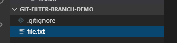
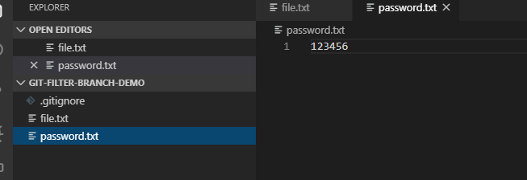
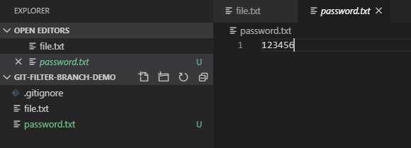
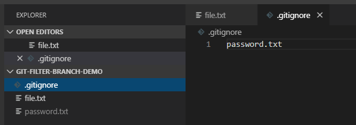
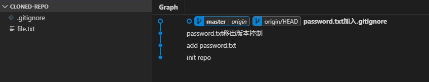
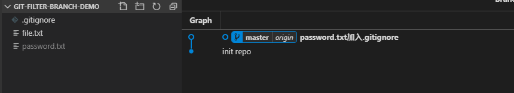

# filter-branch命令删除所有提交中的敏感文件

## 演示

### 1.初始化仓库
初始化一个git仓库 `git-filter-branch-demo`，创建 `.gitignore` 和 `file.txt` 两个文件： 

  

### 2.提交敏感数据文件
创建敏感数据文件 `password.txt` 并提交：



### 3.将敏感数据文件移出版本控制
使用 `git rm --cached password.txt` 命令将 `password.txt`移出版本控制，然后提交本次修改：  

  

### 4.添加敏感数据文件到.gitignore
将 `password.txt` 添加到 `.gitignore`, 然后提交本次修改，以后该文件将不会被跟踪：  

  

### 5. 克隆该仓库
使用git命令：  

```sh
# 返回上级目录，在上级目录克隆一个该仓库，命名为 cloned-repo
cd ..

git clone ./git-filter-branch-demo cloned-repo
```

打开原仓库和克隆后的仓库查看git历史，还是可以看到 `password.txt` 提交记录，并且可以查看到具体内容：  



所以这样处理敏感数据并没有效果。  

### 6.使用filter-branch命令处理
使用 `filter-branch` 命令可以从所有提交中删除指定的文件：  

> 关于 `filter-branch` 命令的详情使用 `git filter-branch --help` 可以查看。  

```sh
# 此处演示删除 password.txt， 实际使用时替换 password.txt 为任何想要删除的文件
# 如果想要删除文件夹， 为 `git rm` 命令添加 -r 参数
git filter-branch --force --index-filter 'git rm --cached --ignore-unmatch password.txt' --prune-empty --tag-name-filter cat -- --all
```  

再次查看git历史，已经不存在关于 `password.txt` 的任何提交:  

  

### 7.修正远程git仓库
如果存在对应的远程仓库，还需要修正远程仓库的提交历史， 有两种做法：    
1. 重新创建一个远程仓库，关联该本地仓库
2. 强制推送当前仓库到远程（必须保证本地仓库是最新的，并且其他开发者需要重新clone远端仓库）： 
   
   ```sh
   git push origin --all --force

   # tags不会被普通git push 提交，还需要显式提交git tags
   git push origin --tags --force
   ```