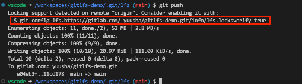
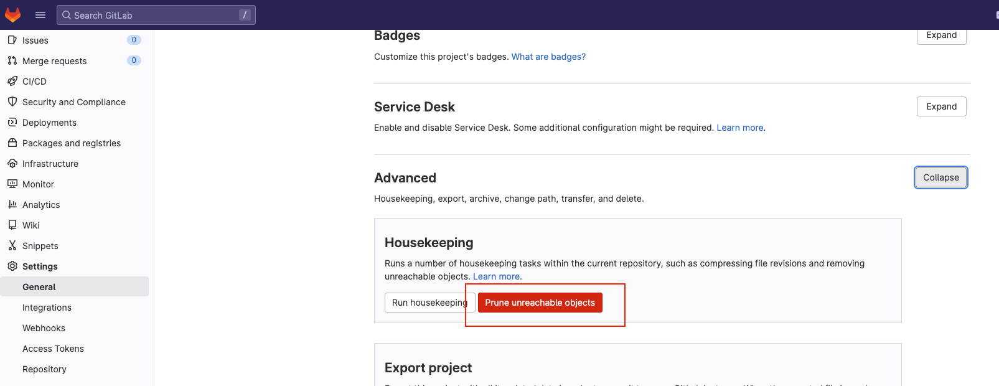
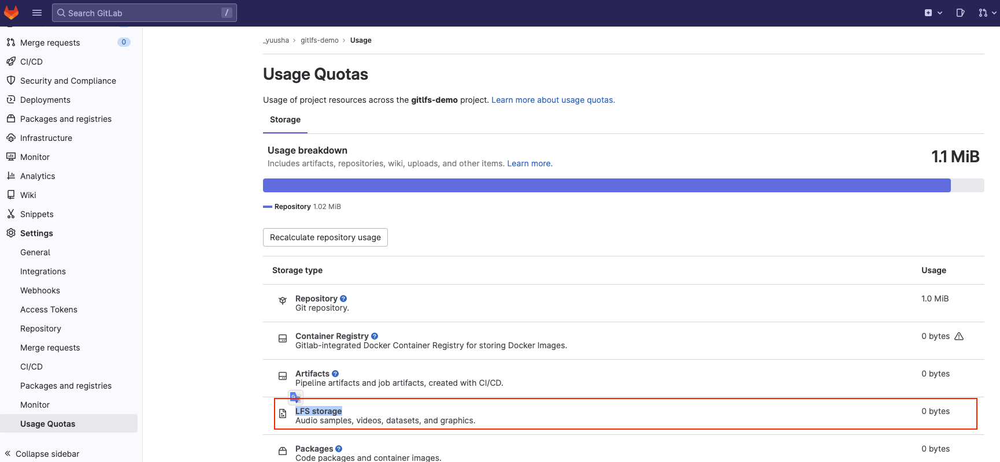

# git-lfs 安装和使用

> 为了避免不再使用 git lfs 时会遇到的卸载相关的麻烦，可以选择不使用 git lfs。只依赖 git，解决仓库体积过大拉取的效率问题可以通过 partial clone 等方式避免。

## git lfs 简介

`git lfs` 是用来管理 `git` 仓库中大文件的命令行插件。

它将你所标记的大文件保存至另外的仓库,而在主仓库仅保留其轻量级指针。在你检出版本时,根据指针的变化情况下更新对应的大文件，而不是在本地保存所有版本的大文件。


## 安装

> 注意：安装 Git LFS 需要 Git 的版本不低于 1.8.5。

参见官网不同平台的安装方式。debian 使用如下命令添加包仓库 URL：

```sh
curl -s https://packagecloud.io/install/repositories/github/git-lfs/script.deb.sh | sudo bash
```

然后使用 `sudo apt-get install git-lfs` 来安装，安装完成后输入以下命令测试安装成功：

```sh
git lfs --version # git-lfs/3.3.0 (GitHub; linux amd64; go 1.19.3)
```

## 使用方式

例如想要使用 `git lfs` 管理 `.psd` 后缀的大文件，首先输入如下命令：

```sh
git lfs track "*.psd"
```

> 注意：双引号不能省略。

然后提交 `.gitattributes` 文件：

```sh
git add .gitattributes
git commit -m "track *.psd files using Git LFS"
```

仓库中历史的大文件不会被 `git lfs` 管理，需要手动使用以下命令让 `git lfs` 管理这些已存在的 `.psd` 文件：

```sh
git lfs migrate import --include="*.psd" --everything
```

注意：这个命令会重写整个提交历史，可能需要强制推送 `git push -f` 覆盖远程仓库中的代码。

接下来可以添加一个 `.psd` 文件来测试 `git lfs` 会自动管理该文件：

```sh
# 使用 dd 命令创建一个 20M 的 1.psd
dd if=/dev/zero of=1.psd bs=1M count=20

git add 1.psd
git commit -m 'add 1.psd'
```

输入以下命令，可以查看 `git lfs` 管理的文件：

```sh
git lfs ls-files

# cd52d81e25 - 1.psd
```

使用 `git push` 推送远程仓库时，会发现先多了上传大文件的步骤：



### 移除 git lfs

如果觉得 `git lfs` 不合适，可以使用以下命令移除 `git lfs` 对该 `git` 仓库的管理，恢复成普通仓库：

```sh
git lfs migrate export --include="*.psd" --everything
```

注意：这个命令会重写整个提交历史，可能需要强制推送 `git push -f` 覆盖远程仓库中的代码。

对于 `gitlab` 还需要到仓库管理页面移除无用的大文件对象，如下图，点击 `prune unreachable objects`即可：



接下来到该页面可以看到仓库存储大小信息，其中包含 `LFS storage` 这一项，表示大文件占用的存储：


