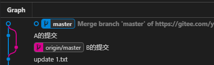
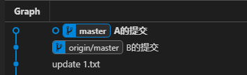
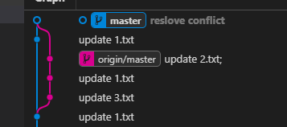
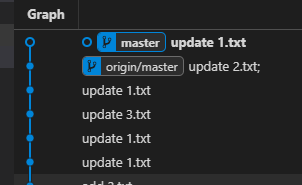
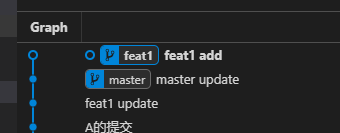

# git rebase

`git rebase` 命令可以将分叉的提交历史线重新整合成一条提交记录线。  

## 场景一：同一分支本地与远程提交历史不一致
A、B同时在master上更新，B先于A推送了提交，A再推送提交时，提示需要先  `git pull` 与远端同步，使用 `git pull` 同步后有两种情况：  

1. 没有冲突，但是git生成了一个"自动合并"提交，git提交历史分叉：  

     

   使用 `git rebase` 整合分支：  

     

2. 有冲突，解决后提交，git提交历史分叉：  

     

   使用 `git rebase` 整合分支：  

     

   > 注意：  
   > 解决冲突后使用 `git rebase` 整合提交历史，可能会需要重新解决冲突，  
   > 为了避免麻烦，可以使用 `git pull --rebase` 在同步远端代码时就进行rebase操作，只需要解决一次冲突。  


## 场景二：不同分支间的合并
基于 `master` 分支新建一个 `feat1` 分支开发新功能，开发完毕后回到 `master` 分支合并 `feat1` 分支的代码，由于开发 `feat1` 分支期间，`master` 分支上已经有了新的提交，
所以出现了“自动合并”提交 (有冲突的情况与此类似，自动合并变成解决冲突的提交)：  

  

此时提交历史出现了分叉，看上去可以使用 `git rebase` 整合一下，但是如果有冲突，需要在 `master` 分支上来解决，并且解决两次（merge时一次，rebase时一次），而不是开发 `feat1` 分支的人来负责解决冲突，所以不推荐使用 `merge`，而是推荐在 `feat1` 分支上使用  

```sh
git rebase master
```  

命令来基于`master`分支进行rebase:  

  

在 `feat1` 分支上整合提交历史，将`feat1` 分支的最新提交(即：图中的 `feat1 add` 提交记录)成为 `master` 分支的直接下游，这样 `master` 分支合并 `feat1` 分支时可以快速合并，不会出现 "自动合并" 的提交记录，  
并且这样还可以将解决冲突的责任转移给开发 `feat1` 的人，主分支只需要负责 `merge` ，如果 `merge` 有冲突就放弃本次 `merge` ,让 `feat1` 分支基于最新的 `master` 分支重新 `rebase` 之后再请求合并。  


