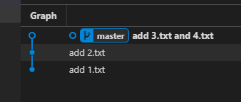

# git rebase

- [场景一：同一分支本地与远程提交历史不一致](#%e5%9c%ba%e6%99%af%e4%b8%80%e5%90%8c%e4%b8%80%e5%88%86%e6%94%af%e6%9c%ac%e5%9c%b0%e4%b8%8e%e8%bf%9c%e7%a8%8b%e6%8f%90%e4%ba%a4%e5%8e%86%e5%8f%b2%e4%b8%8d%e4%b8%80%e8%87%b4)
- [场景二：不同分支间的合并](#%e5%9c%ba%e6%99%af%e4%ba%8c%e4%b8%8d%e5%90%8c%e5%88%86%e6%94%af%e9%97%b4%e7%9a%84%e5%90%88%e5%b9%b6)
- [补充](#%e8%a1%a5%e5%85%85)
  - [1.rebase 之后如何恢复到之前的状态](#1rebase-%e4%b9%8b%e5%90%8e%e5%a6%82%e4%bd%95%e6%81%a2%e5%a4%8d%e5%88%b0%e4%b9%8b%e5%89%8d%e7%9a%84%e7%8a%b6%e6%80%81)
  - [2.rebase 合并 commit，调整 commit 顺序, 修改 commit 信息](#2rebase-%e5%90%88%e5%b9%b6-commit%e8%b0%83%e6%95%b4-commit-%e9%a1%ba%e5%ba%8f-%e4%bf%ae%e6%94%b9-commit-%e4%bf%a1%e6%81%af)
    - [2.1 合并 commit](#21-%e5%90%88%e5%b9%b6-commit)
    - [2.2 调整 commit 顺序](#22-%e8%b0%83%e6%95%b4-commit-%e9%a1%ba%e5%ba%8f)
    - [2.3 删除某个 commit](#23-%e5%88%a0%e9%99%a4%e6%9f%90%e4%b8%aa-commit)

`git rebase` 命令可以将分叉的提交历史线重新整合成一条提交记录线。

## 场景一：同一分支本地与远程提交历史不一致

A、B 同时在 master 上更新，B 先于 A 推送了提交，A 再推送提交时，提示需要先 `git pull` 与远端同步，使用 `git pull` 同步后有两种情况：

1. 没有冲突，但是 git 生成了一个"自动合并"提交，git 提交历史分叉：

   

   使用 `git rebase` 整合分支：

   

2. 有冲突，解决后提交，git 提交历史分叉：

   

   使用 `git rebase` 整合分支：

   

   > 注意：  
   > 解决冲突后使用 `git rebase` 整合提交历史，可能会需要重新解决冲突，  
   > 为了避免麻烦，可以使用 `git pull --rebase` 在同步远端代码时就进行 rebase 操作，只需要解决一次冲突。

## 场景二：不同分支间的合并

基于 `master` 分支新建一个 `feat1` 分支开发新功能，开发完毕后回到 `master` 分支合并 `feat1` 分支的代码，由于开发 `feat1` 分支期间，`master` 分支上已经有了新的提交，
所以出现了“自动合并”提交 (有冲突的情况与此类似，自动合并变成解决冲突的提交)：


此时提交历史出现了分叉，看上去可以使用 `git rebase` 整合一下，但是如果有冲突，需要在 `master` 分支上来解决，并且解决两次（merge 时一次，rebase 时一次），而不是开发 `feat1` 分支的人来负责解决冲突，所以不推荐使用 `merge`，而是推荐在 `feat1` 分支上使用

```sh
git rebase master
```

命令来基于`master`分支进行 rebase:


在 `feat1` 分支上整合提交历史，将`feat1` 分支的最新提交(即：图中的 `feat1 add` 提交记录)成为 `master` 分支的直接下游，这样 `master` 分支合并 `feat1` 分支时可以快速合并，不会出现 "自动合并" 的提交记录，  
并且这样还可以将解决冲突的责任转移给开发 `feat1` 的人，主分支只需要负责 `merge` ，如果 `merge` 有冲突就放弃本次 `merge` ,让 `feat1` 分支基于最新的 `master` 分支重新 `rebase` 之后再请求合并。

## 补充

### 1.rebase 之后如何恢复到之前的状态

使用 `git rebase <分支名>` 之后，当前分支的历史就会变成<分支名>的历史，可以通过

```sh
git reflog <当前分支名>
```

命令来找到当前分支曾经指向过的 `commit`，然后 `git reset --hard <commit-id>` 就可以恢复了。

### 2.rebase 合并 commit，调整 commit 顺序, 修改 commit 信息

`git rebase` 命令可以用来合并 commit，调整 commit 顺序。

> 如果 rebase 的范围不是从最后一次提交开始往前的范围，而只是指定了中间某些 commit，那么执行完之后会在一个单独的分支上，需要配合`cherry-pick`命令来完成，如 #2.2，#2.3 所述。

#### 2.1 合并 commit

示例仓库提交记录如下图：


想要将最后两个 commit 合并成一个 commit，可以使用

```sh
git rebase -i <start-commit-id> <end-commit-id>
```

（前开后闭区间）形式的命令来操作。  
不指定 `<end-commit-id>`，即到当前分支的 HEAD 指向的 commit。

```sh
# 'add 2.txt' 对应的commit-id为：25ca2f3
git rebase -i 25ca2f3
```

输入命令后控制台弹出操作页面，使用 vim 命令操作，可用命令显示在下方：


`squash` (缩写 `s`) 是合并 commit 到上一个 commit，想要将 `add 2.txt` 和 `add 3.txt` 合并，只需要将第二行的 `pick` 改为 `squash` (或 `s`)：


保存后弹出修改 commit 信息的操作页面：


如下图，修改 commit 信息，如提示所述，可以用 `#` 注释掉不需要的 commit 信息：


合并成功:



> 注意： 如果合并的是中间部分的某些提交，rebase 之后当前 HEAD 指针会出现在一个游离分支上，而不是在 `master` 分支上，此时需要使用 `cherry-pick` 命令来调整，详见[cherry-pick](cherry-pick.md)一节。

#### 2.2 调整 commit 顺序

与 [#2.1 合并 commit](#21-%e5%90%88%e5%b9%b6-commit) 操作类似，在 `git rebase -i <commit-id> <commit-id>` 之后弹出的页面中，将各个 commit 行调整成想要的顺序，然后保存即可。

> 注意： 如果调整的是中间部分的某些提交，rebase 之后当前 HEAD 指针会出现在一个游离分支上，而不是在 `master` 分支上，此时需要使用 `cherry-pick` 命令来调整，详见[cherry-pick](cherry-pick.md)一节。

#### 2.3 删除某个 commit

与 [#2.1 合并 commit](#21-%e5%90%88%e5%b9%b6-commit) 操作类似，在 `git rebase -i <commit-id> <commit-id>` 之后弹出的页面中，使用 `drop` 关键字即可。

> 注意： 如果删除的是中间部分的某些提交，rebase 之后当前 HEAD 指针会出现在一个游离分支上，而不是在 `master` 分支上，此时需要使用 `cherry-pick` 命令来调整，详见[cherry-pick](cherry-pick.md)一节。
